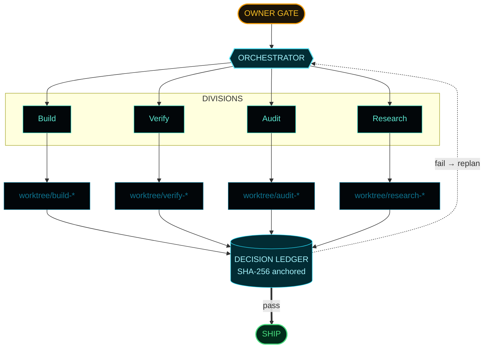
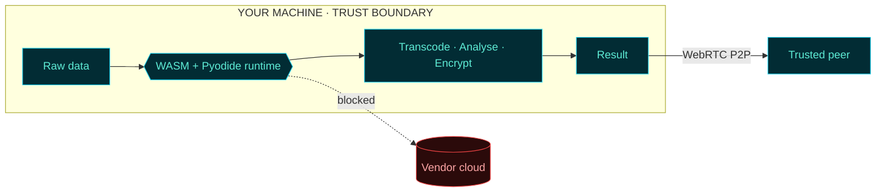

<p align="center">
  
</p>

<p align="center">
  
  
  
  
  <a href="https://orcid.org/0000-0002-6070-9025"></a>
</p>

---

```console
root@localhost:~# ./initialize --operator jesun

  [  OK  ] identity ................. Jesun Ahmad Ushno
  [  OK  ] role ..................... AI Engineer & Data Architect
  [  OK  ] station .................. Toronto, ON
  [  OK  ] egress policy ............ DENY ALL
  [  OK  ] integrity ................ SHA-256 verified
  [ WARN ] cloud dependency ......... none detected. proceeding.

root@localhost:~# cat /etc/doctrine

  [1] The cheapest way to secure data is to never collect it.
  [2] Compliance is a design constraint, not a document.
  [3] If it can run in the tab, it has no business on a server.
  [4] A rule worth having is a rule the code enforces, not one a doc describes.
  [5] Ship the system, never the mockup.
```

## ▚▚ DOCTRINE

Four years of IT advisory and ISO 27001 audit work at KPMG taught the same
lesson on every engagement: the breach you cannot have is the one on data you
never held. So I stopped designing systems that collect, and started designing
systems that compute where the data already lives.

Then the same instinct went up a level. A single agent doing the work is a
system that collects trust. A fleet with explicit autonomy tiers, adversarial
verification and an owner gate is a system that earns it.

## ▚▚ ORCHESTRATION LAYER

<p align="center">
  
</p>

Work does not go to one agent. It goes through a lattice. Intake scopes and
gates it, plan fixes acceptance criteria before a line is written, worker
agents run in parallel on isolated git worktrees, and nothing reaches ship
without an adversarial verification pass and an explicit owner signoff.

**Autonomy is tiered, not granted.** Every seat in the fleet sits in one of
three bands, and the band decides what it may do unsupervised:

| tier | authority | gate |
| :--- | :--- | :--- |
| `AUTO` | executes and commits without asking | post-hoc audit trail |
| `SIGNOFF` | executes, holds at the boundary | human approves before merge |
| `ANCHORED` | may not act, may only propose | owner authorises every step |



Every decision is logged before it is acted on, not after. The ledger is the
system of record, so a session that starts cold reads state and continues
rather than guessing.

## ▚▚ THE PERIMETER

The other half of the doctrine. Data does not travel to the compute. The
compute travels to the data.



## ▚▚ DEPLOYED SYSTEMS

| | system | payload | runtime |
| :--: | :--- | :--- | :--- |
| `01` | **[PRISM](https://github.com/JesunAhmadUshno/PRISM)** | Zero-trust analytics. A full Python statistics engine executing inside the tab, nothing transmitted. | `TypeScript` `Pyodide` `Web Workers` |
| `02` | **[BigFish](https://github.com/JesunAhmadUshno/BigFish)** | Autonomous betting terminal. A swarm orchestrator dispatching tactical, sentiment and execution agents against EV thresholds with Kelly sizing. | `JavaScript` `Multi-agent` |
| `03` | **[NoPara](https://github.com/JesunAhmadUshno/NoPara)** | Serverless media conversion. Transcoding runs client-side, so the file never leaves the machine. GDPR and PIPEDA by construction. | `FFmpeg.wasm` `PWA` |
| `04` | **[TriDrop](https://github.com/JesunAhmadUshno/TriDrop)** | iPhone to Windows transfer with no intermediary host. Scan, connect, stream peer to peer. | `WebRTC` `STUN/TURN` |
| `05` | **[dingdong-bms](https://github.com/JesunAhmadUshno/dingdong-bms)** | Building management across tenants, maintenance and billing. | `Next.js` `React` `TypeScript` |
| `06` | **[SonicClear](https://github.com/JesunAhmadUshno/SonicClear-AI-Studio-Grade-Audio-Enhancer)** | Speech restoration pipeline. Studio-grade output from noisy input. | `Flask` `NumPy` `SciPy` |
| `07` | **[drawing_modal](https://github.com/JesunAhmadUshno/drawing_modal)** | Canvas capture instrument recording 20+ measurements per point, including velocity, twist and in-air hover trajectory. | `Canvas` `Serverless` |

> **Active build.** Prime OS, a multi-tier agent operating layer with a 191-seat
> org chart, autonomy banding and structural policy enforcement. Not a
> documentation exercise: a violated rule raises, it does not warn.

## ▚▚ CAPABILITY MATRIX

| domain | instruments |
| :--- | :--- |
| **Orchestration** | Multi-agent fleets · autonomy tiering · git worktree isolation · adversarial verification · decision ledgers |
| **Edge compute** | WebAssembly · FFmpeg.wasm · Pyodide · Web Workers · Service Workers · WebCrypto |
| **Realtime** | WebRTC DataChannels · STUN/TURN · WebSockets · Node signaling |
| **Data** | pandas · NumPy · SciPy · scikit-learn · TensorFlow · Power BI · Tableau |
| **Assurance** | ISO/IEC 27001:2022 · GDPR Art. 32 · PIPEDA · OWASP Top 10 · WCAG 2.2 AAA · SHA-256 integrity anchoring |
| **Method** | Lean Six Sigma · DMAIC · phase-gated execution · acceptance criteria before code |

## ▚▚ STACK

<p>
  
  
  
  
  
  
</p>
<p>
  
  
  
  
  
  
</p>
<p>
  
  
  
  
  
  
  
</p>

<details>
<summary><b>▚ RESEARCH LOG</b></summary>

<br>

Two peer-reviewed conference papers, AIP Conference Proceedings (2023):

- Fabric-defect detection using wavelet transform with neural networks
- An elitist variant of particle swarm optimization

Indexed at [ORCID](https://orcid.org/0000-0002-6070-9025) and
[Google Scholar](https://scholar.google.com/citations?user=BR2tycQAAAAJ).

**Writing.** *Beyond the Firewall*, arguing cybersecurity should be run as a
measurable DMAIC process rather than a posture. Plus a beginner's guide to data
analytics (ResearchGate, 2025).

</details>

<details>
<summary><b>▚ SERVICE RECORD</b></summary>

<br>

| period | post |
| :--- | :--- |
| 2025 to present | **Gallea Ai** · AI Engineer & Data Architect |
| 2023 to 2024 | **KPMG** · IT Advisory, Officer to Senior Officer to Consultant. 20+ Power BI dashboards, Power Automate workflows saving 200+ hours, ISO 27001 audits across banking and healthcare. |
| 2021 to 2023 | **ESAB, AIUB** · Student Engagement Facilitator, 300+ students |

**Training.** MSc Data Analytics, University of Niagara Falls Canada (2025 to
2026), holding the UNF Academic Achievement Entrance Award and the Academic
Performance Scholarship. BSc Computer Engineering, American International
University-Bangladesh.

**Certified.** Oracle Cloud Infrastructure AI Foundations · Certified Network
Security Practitioner (CNSP) · Cisco CyberOps Associate, Network Defense,
Endpoint Security, Cyber Threat Management · IBM Data Fundamentals · Lean Six
Sigma White Belt

</details>

<details>
<summary><b>▚ FIELD OPERATIONS</b></summary>

<br>

Engineered donation-tracking frameworks and coordinated humanitarian logistics
networks for winter asset allocation and flood relief, reaching 50,000+
regional families. Same systems engineering, different problem domain.

</details>

---

<p align="center">
  <a href="https://jesunahmadushno.com"></a>
  <a href="https://linkedin.com/in/jesunahmadushno"></a>
  <a href="https://behance.net/jesunushno"></a>
  <a href="https://dribbble.com/JesunAhmadUshno"></a>
</p>

<p align="center">
  <sub><code>session terminated · no data written to remote</code></sub>
</p>
