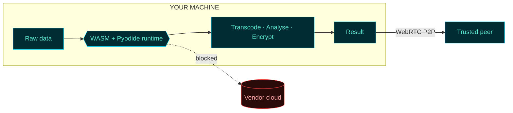

<p align="center">
  
</p>

<p align="center">
  
  
  
  <a href="https://orcid.org/0000-0002-6070-9025"></a>
</p>

---

```console
$ ssh jesun@localhost
  authenticating ............. OK
  egress policy .............. DENY ALL
  runtime .................... WASM / Pyodide / WebRTC

$ whoami
  Jesun Ahmad Ushno
  AI Engineer & Data Architect @ Gallea Ai

$ cat /etc/principles
  [1] The cheapest way to secure data is to never collect it.
  [2] Compliance is a design constraint, not a document.
  [3] If it can run in the tab, it has no business on a server.
```

## ▚ THE THESIS

Four years of IT advisory and ISO 27001 audit work at KPMG taught me the same
lesson on every engagement: the breach you cannot have is the one on data you
never held. So I stopped building systems that collect, and started building
systems that compute where the data already lives.

Everything below runs in your browser tab. No upload step. No server-side copy.
No retention policy you have to take on faith.



## ▚ DEPLOYED SYSTEMS

| | system | payload | runtime |
| :--: | :--- | :--- | :--- |
| `01` | **[PRISM](https://github.com/JesunAhmadUshno/PRISM)** | Zero-trust analytics. Full Python statistics engine executing inside the tab, nothing transmitted. | `TypeScript` `Pyodide` `Web Workers` |
| `02` | **[BigFish](https://github.com/JesunAhmadUshno/BigFish)** | Autonomous betting terminal. A swarm orchestrator dispatches tactical, sentiment and execution agents against EV thresholds with Kelly sizing. | `JavaScript` `Multi-agent` |
| `03` | **[NoPara](https://github.com/JesunAhmadUshno/NoPara)** | Serverless media conversion. Transcoding runs client-side, so the file never leaves the machine. GDPR and PIPEDA by construction. | `FFmpeg.wasm` `PWA` |
| `04` | **[TriDrop](https://github.com/JesunAhmadUshno/TriDrop)** | iPhone to Windows transfer with no intermediary host. Scan, connect, stream peer to peer. | `WebRTC` `STUN/TURN` |
| `05` | **[dingdong-bms](https://github.com/JesunAhmadUshno/dingdong-bms)** | Building management across tenants, maintenance and billing. | `Next.js` `React` `TypeScript` |
| `06` | **[SonicClear](https://github.com/JesunAhmadUshno/SonicClear-AI-Studio-Grade-Audio-Enhancer)** | Speech restoration pipeline. Studio-grade output from noisy input. | `Flask` `NumPy` `SciPy` |

## ▚ STACK

<p>
  
  
  
  
  
</p>
<p>
  
  
  
  
  
</p>
<p>
  
  
  
  
  
  
</p>
<p>
  
  
  
  
</p>

> Standards designed against, not bolted on: **ISO/IEC 27001:2022** · **GDPR Art. 32** · **PIPEDA** · **OWASP Top 10** · **WCAG 2.2 AAA**

<details>
<summary><b>▚ RESEARCH LOG</b></summary>

<br>

Two peer-reviewed conference papers, AIP Conference Proceedings (2023):

- Fabric-defect detection using wavelet transform with neural networks
- An elitist variant of particle swarm optimization

Indexed at [ORCID](https://orcid.org/0000-0002-6070-9025) and
[Google Scholar](https://scholar.google.com/citations?user=BR2tycQAAAAJ).

**Writing.** *Beyond the Firewall*, on treating cybersecurity as a measurable
DMAIC process rather than a posture. Plus a beginner's guide to data analytics
(ResearchGate, 2025).

</details>

<details>
<summary><b>▚ SERVICE RECORD</b></summary>

<br>

| period | post |
| :--- | :--- |
| 2025 to present | **Gallea Ai** · AI Engineer & Data Architect |
| 2023 to 2024 | **KPMG** · IT Advisory, Officer to Senior Officer to Consultant. 20+ Power BI dashboards, Power Automate workflows saving 200+ hours, ISO 27001 audits across banking and healthcare. |
| 2021 to 2023 | **ESAB, AIUB** · Student Engagement Facilitator, 300+ students |

**Training.** MSc Data Analytics, University of Niagara Falls Canada (2025 to
2026), holding the UNF Academic Achievement Entrance Award and Academic
Performance Scholarship. BSc Computer Engineering, American International
University-Bangladesh.

**Certified.** Oracle Cloud Infrastructure AI Foundations · Certified Network
Security Practitioner (CNSP) · Cisco CyberOps Associate, Network Defense,
Endpoint Security, Cyber Threat Management · IBM Data Fundamentals · Lean Six
Sigma White Belt

</details>

<details>
<summary><b>▚ FIELD OPERATIONS</b></summary>

<br>

Engineered donation-tracking frameworks and coordinated humanitarian logistics
networks for winter asset allocation and flood relief, reaching 50,000+
regional families. Same systems engineering, different problem domain.

</details>

---

<p align="center">
  <a href="https://jesunahmadushno.com"></a>
  <a href="https://linkedin.com/in/jesunahmadushno"></a>
  <a href="https://behance.net/jesunushno"></a>
  <a href="https://dribbble.com/JesunAhmadUshno"></a>
</p>

<p align="center">
  <sub><code>connection closed by remote host</code></sub>
</p>
